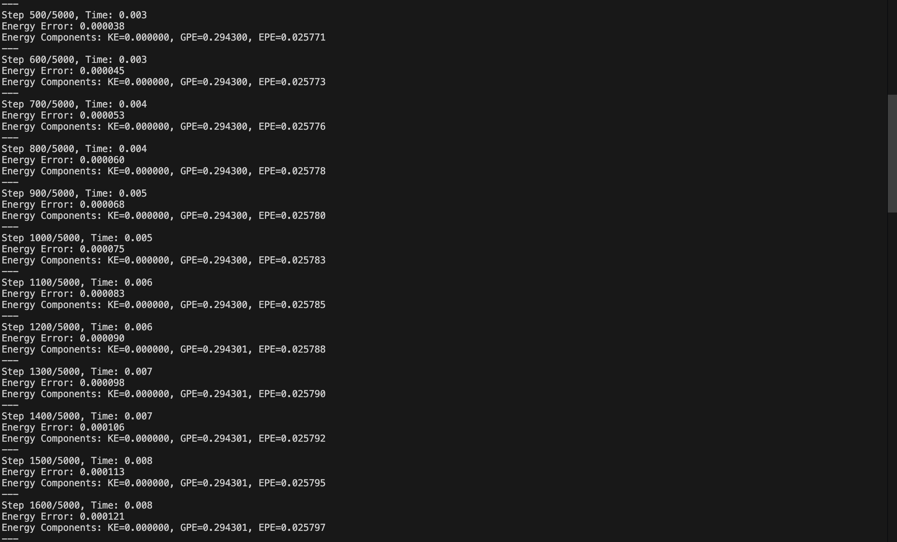

# Overview

This Tensegrity program aims to visualize a tensegrity system dynamically in order to optimize to its general geometric structure for both dynamic loads and extending resistance to failure at points.

This simulator includes:

- Dynamic simulation with verlet evolution
- Energy conservation analysis
- Real-time 3D visualization with matplotlib animate
- Material property consideration for the cables and struts
- Physical constraint enforcement.

## Physics Model

The simulator uses steel cables with a stiffness of 2000 N/m, and a maximum tension of 2000N and aluminum struts with a stiffness of 1000 N/m and a maximum compression of 1000N. These values can be changed in the client code to simulate different material. The perturbance can also be modified in the client code as well as the general node/strut/cable structure of the tensegrity system to simulate entirely different systems.

The system tracks three different types of energy: kinetic energy, gravitational potential energy, and elastic potential energy.

### Output

The code outputs a live viewing of the evolution of the inputted tensegrity system along with graphs for an energy analysis and error rate over time.

This how the tensegrity system evolves to be in static equilibrium after a small perturbance. It can be seen in the energy analysis, specifically the elastic, how the perturbance evolves throughout the system to "squash" it and get the system back into static equilibrium.

The exact outputs for the energy analysis and error rate are outputted to the console for closer analysis.

### Color coding

- Red dashed lines: Cables (tension elements)
- Blue solid lines: Struts (compression elements)
- Black dots: Nodes

Due to limited time, I did not have time to implement optimization path formulas that dynamically change the geometric structure of the tensegrity system. This program merely acts as a dynamic simulation of a tensegrity system and can be used to show how they work and how energy evolves over time in a static tensegrity system, or how the system acts when perturbed as a certain point. It can also be used to create any tensegrity system, by customizing the arrangement of nodes and cable and struct connections and see how the energy analysis changes and if the tensegrity structure remains static.
