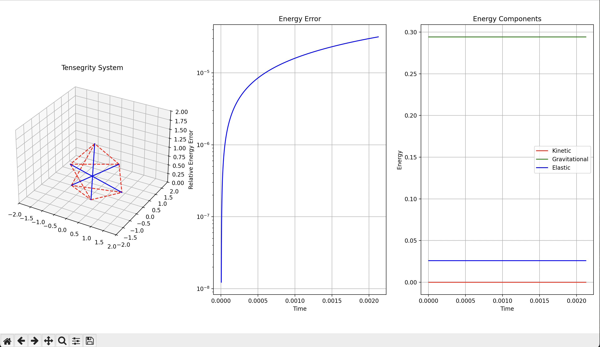

# Overview

This Tensegrity program aims to visualize a tensegrity system dynamically in order to optimize to its general geometric structure for both dynamic loads and extending resistance to failure at points.

This simulator includes:

- Dynamic simulation with verlet evolution
- Energy conservation analysis
- Real-time 3D visualization with matplotlib animate
- Material property consideration for the cables and struts
- Physical constraint enforcement.

## Physics Model

The simulator uses steel cables with a stiffness of 2000 N/m, and a maximum tension of 2000N and aluminum struts with a stiffness of 1000 N/m and a maximum compression of 1000N. These values can be changed in the client code to simulate different material. The perturbance can also be modified in the client code as well as the general node/strut/cable structure of the tensegrity system to simulate entirely different systems.

The system tracks three different types of energy: kinetic energy, gravitational potential energy, and elastic potential energy.

### Output

The code outputs a live viewing of the evolution of the inputted tensegrity system along with graphs for an energy analysis and error rate over time.

This how the tensegrity system evolves to be in static equilibrium after a small perturbance. It can be seen in the energy analysis, specifically the elastic, how the perturbance evolves throughout the system to "squash" it and get the system back into static equilibrium.

The exact outputs for the energy analysis and error rate are outputted to the console for closer analysis.

### Color coding

- Red dashed lines: Cables (tension elements)
- Blue solid lines: Struts (compression elements)
- Black dots: Nodes

### Connection to statics

The equations of static equilibrium, sum F = 0 and sum M = 0, are intrinsically represented in the dynamic simulation, specifically in the `get_forces()` method in `TensegritySystem`. The system evolves according to Newtons Second Law (F=ma), and when the acceleration approaches zero, the equations naturally reduce to the static equilibrium conditions.

### Dynamic equations

The dynamic equation used is the velocity Verlet integration method for position updates and velocity updates and are as so:

x(t + Δt) = x(t) + v(t)Δt + (1/2)a(t)Δt²
v(t + Δt) = v(t) + (1/2)(a(t) + a(t + Δt))Δt

Here is a link to the wikipedia page for Verlet integration:

<https://en.wikipedia.org/wiki/Verlet_integration>

They are known for having excellent energy conservation properties in molecular dynamics and structural simulations, with the energy error rate of the system being usually negligible for engineering purposes.

### Verification of results

1. The equations implemented are well established equations, such as the verlet equations and the equations for kinetic energy, potential energy, and gravitional energy. These can be, and have been, verified for simple scenarios in the tests module to make sure energy is calculated properly.

2. The system enforces physically realistic behavior through its code structure. The cables are coded to operate exclusively in tension and the struts are coded to only function in compression, and the energy analysis mirrors that. The outputted values are realistic, in that they have no large jumps or obviously unreal numbers that don't make sense.

3. The system demonstrates appropriate energy conservation and stability characteristics. When the structure reaches static equilibrium, the energy remains constant--which makes sense for static objects. This is shown to not be just a fluke because the system can be perturbed and as long as it doesn't fail, break, then the KE, EPE, and GPE graph will eventually go back to being constant, which is indicative of a static system.

### Post script

Due to limited time, I did not have time to implement optimization path formulas that dynamically change the geometric structure of the tensegrity system. This program merely acts as a dynamic simulation of a tensegrity system and can be used to show how they work and how energy evolves over time in a static tensegrity system, or how the system acts when perturbed as a certain point. It can also be used to create any tensegrity system, by customizing the arrangement of nodes and cable and struct connections and see how the energy analysis changes and if the tensegrity structure remains static.
